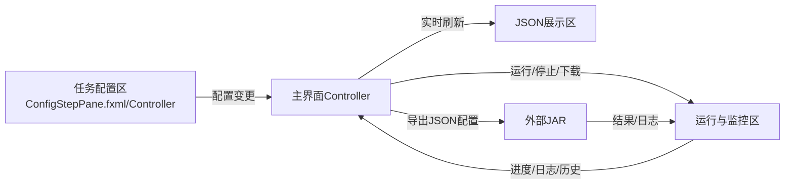

# Paipi DB Web

## 项目简介

Paipi DB Web 是一款基于 JavaFX 的桌面端数据同步配置与管理工具，支持多数据源同步、可视化参数配置、transformer链、运行监控、日志、历史、导入导出等功能。支持一键打包为 Windows 下的 exe 可执行程序。

## 主要功能
- 多种同步模式（DB_TO_FILE、EXECUTE_SQL、DB_TO_DB）
- 支持 Mysql、Postgresql、Hive、TxtFile、HBase 等数据源
- 可视化参数配置、transformer链编辑
- 运行监控、日志、历史记录
- 配置导入导出、经典配置一键加载
- JAR 路径自动查找与持久化
- 支持打包为 Windows exe

## 开发环境
- JDK 14 及以上（推荐 JDK 17 或 21）
- Maven 3.6+
- JavaFX 11+（OpenJFX，已集成在依赖中）
- Windows 10/11

## 如何运行

1. **编译项目**
   ```sh
   mvn clean package
   ```
   生成的 JAR 位于 `target/paipi_db-1.0-SNAPSHOT-jar-with-dependencies.jar`

2. **运行桌面应用**
   ```sh
   java -jar target/paipi_db-1.0-SNAPSHOT-jar-with-dependencies.jar
   ```
   或用 IDE 直接运行 `com.paipi.DbDesktopApp` 主类

3. **JAR 路径自动查找**
   - 启动后如未手动选择 JAR，程序会自动查找 resources 目录下的 JAR 并填入。

## 如何打包为 Windows exe

使用JDK8，推荐用 [Launch4j](http://launch4j.sourceforge.net/) 将fat jar打包为exe。

### 步骤：
1. 下载并解压 Launch4j。
2. 用 Maven 打包 fat jar：
   ```sh
   mvn clean package
   ```
   生成 `target/paipi_db-1.0-SNAPSHOT-jar-with-dependencies.jar`
3. 打开 `launch4j.exe`，配置如下参数：
   - **Output file**：生成的 exe 路径，如 `target/PaipiDB.exe`
   - **Jar**：你的 fat jar 路径，如 `target/paipi_db-1.0-SNAPSHOT-jar-with-dependencies.jar`
   - **Don't wrap the jar, launch only**：不要勾选
   - **Classpath**：留空（fat jar 不需要）
   - **JRE**：最小版本 `1.8.0`
   - **Main class**：`com.paipi.EngineDesktopApp`
   - **JVM options**：`-Dfile.encoding=UTF-8`
   - **Icon**：可选，选择你的 ico 文件
4. 其它参数可默认。
5. 点击“齿轮”按钮生成 exe。
6. 运行 `target/PaipiDB.exe`，需本机已安装 JRE8。

如需制作安装包，可用 Inno Setup 等工具进一步打包。
图标制作网址：https://www.icoconverter.com/
## 典型用法
- 启动后，左侧选择同步模式、数据源类型，填写参数
- 可点击“加载经典配置”一键加载典型模板
- 右侧选择/自动填充 JAR 路径，点击“运行”
- 日志、进度、历史实时展示
- 支持配置导入导出

## 项目架构图



## 目录结构
```
paipi_db_web/
  ├─ src/
  │  └─ main/
  │     ├─ java/com/paipi/...
  │     └─ resources/
  │         ├─ fxml/
  │         ├─ datasource-config-model-0.json
  │         ├─ datasource-config-model-1.json
  │         └─ datasource-config-model-2.json
  ├─ doc/
  │   └─ 开发交接说明.md
  ├─ pom.xml
  └─ README.md
```

## 常见问题
- **JAR 路径无效/未自动填充？**
  - 请确认 resources 下有 paipi_db-1.0-SNAPSHOT-jar-with-dependencies.jar
- **打包exe报错？**
  - 请确认 JDK 版本 >= 14，命令行参数正确
- **JavaFX相关报错？**
  - 请确认依赖已正确引入，或用 jpackage 自动打包 JRE

## 联系与支持
如有问题可联系开发者，或查阅 doc/开发交接说明.md。 

