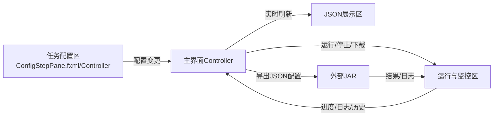
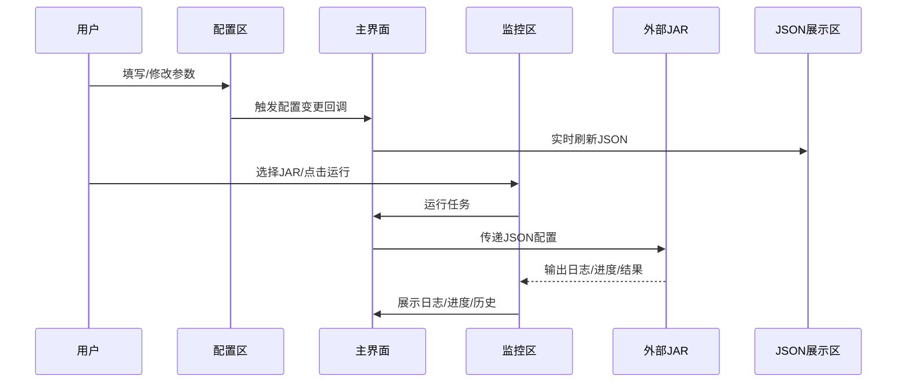

# Paipi DB 数据同步配置与管理工具 交接说明

> JavaFX桌面端，三分区平铺，支持多数据源同步与可视化配置，支持一键打包为exe

---

## 一、项目整体架构与技术栈

- **前端技术**：JavaFX（FXML + 控制器），桌面端UI，三分区平铺布局
- **后端执行**：通过外部JAR（paipi_db-1.0-SNAPSHOT-jar-with-dependencies.jar）完成真实数据同步
- **配置格式**：全流程JSON，结构与后端JAR完全兼容
- **主要功能**：参数可视化配置、transformer链、全局setting、运行监控、日志、历史、导入导出、JAR联动
- **打包方式**：推荐使用JDK 14+自带的jpackage工具直接打包为exe

---

## 二、核心界面与模块结构

### 1. 主界面（MainWindow.fxml + MainWindowController.java）

- **三分区平铺布局**（HBox）：
  - **左侧：任务配置区**（configTabPane，嵌入ConfigStepPane.fxml）
  - **中间：JSON展示区**（jsonArea，实时反映左侧配置）
  - **右侧：运行与监控区**（monitorTabPane，含JAR路径、运行控制、日志、历史、技术支持）

- **主要控件绑定**：
  - `@FXML AnchorPane configTabPane`
  - `@FXML TextArea jsonArea`
  - `@FXML TextField jarPathField`
  - `@FXML ProgressBar runProgressBar`
  - `@FXML TextArea runLogTextArea`
  - `@FXML ListView<String> runHistoryListView`

- **核心逻辑**：
  - 加载任务配置表单（ConfigStepPane.fxml）
  - 监听配置变更，实时刷新JSON展示区
  - 运行/停止/下载任务，实时展示日志与进度
  - 历史记录持久化
  - JAR路径选择与持久化，支持自动查找resources下的JAR

---

### 2. 任务配置区（ConfigStepPane.fxml + ConfigStepPaneController.java）

- **分步表单**：全局setting、同步模式、数据源类型、参数填写、transformer链配置
- **表单控件**：ComboBox、TextField、CheckBox、TableView等
- **transformer链**：支持链式增删改查、顺序调整、参数填写、预览
- **配置校验**：validateAllParams方法严格校验所有必填项和格式（EXECUTE_SQL模式下只校验连接参数和SQL语句）
- **配置变更回调**：setOnConfigChanged/triggerConfigChanged，供主界面JSON区实时刷新
- **加载经典配置**：根据当前同步模式自动加载resources下对应的经典配置

---

### 3. 运行与监控区

- **JAR路径选择**：TextField + 选择按钮，支持自动查找resources下的JAR
- **运行控制**：运行、停止、下载结果按钮
- **进度条**：runProgressBar
- **日志输出**：runLogTextArea
- **历史记录**：runHistoryListView
- **技术支持**：右下角联系人信息

---

## 三、架构图 & 流程图

### 1. 总体架构图

### 2. 运行流程图

---

## 四、主要代码文件与功能说明

| 文件路径 | 主要功能 |
|----------|----------|
| src/main/resources/fxml/MainWindow.fxml | 主界面三分区平铺布局，所有UI结构 |
| src/main/java/com/paipi/controller/MainWindowController.java | 主界面控制器，负责加载配置区、JSON区、监控区，运行任务、日志、历史、JAR联动、配置变更监听 |
| src/main/resources/fxml/ConfigStepPane.fxml | 任务配置分步表单UI |
| src/main/java/com/paipi/controller/ConfigStepPaneController.java | 任务配置表单控制器，参数校验、transformer链、配置变更回调、加载经典配置 |
| src/main/java/com/paipi/config/DataSourceConfig.java | 数据源配置模型 |
| src/main/java/com/paipi/config/JobConfig.java | 任务配置模型 |
| src/main/java/com/paipi/config/SettingConfig.java | setting配置模型 |
| src/main/java/com/paipi/config/TransformerConfig.java | transformer链配置模型 |
| src/main/java/com/paipi/tool/SyncTool.java | 同步工具类 |
| src/main/resources/datasource-config-model-0.json | DB_TO_FILE模式经典配置 |
| src/main/resources/datasource-config-model-1.json | EXECUTE_SQL模式经典配置 |
| src/main/resources/datasource-config-model-2.json | DB_TO_DB模式经典配置 |

---

## 五、开发要点与注意事项

- **所有配置均以JSON为核心，结构需与后端JAR完全兼容**
- **参数校验要严格，防止NPE和格式错误**
- **transformer链与主配置对象、JSON内容始终同步**
- **运行任务时，需导出JSON为临时文件，JVM参数强制UTF-8**
- **所有UI控件与Controller字段一一对应，避免FXML注入NPE**
- **历史记录、JAR路径等需持久化，便于用户体验**
- **三分区平铺布局，宽高自适应，风格统一，体验专业**
- **打包为exe推荐用jpackage，详见README**

---

## 六、未完成/可扩展功能清单

- **多任务并发运行支持**（当前仅支持单任务）
- **更丰富的transformer链类型与参数可视化**
- **任务模板/批量导入导出/批量运行**
- **更细致的运行监控（如资源占用、失败重试等）**
- **UI主题切换/暗色模式**
- **更完善的异常链展示与用户友好提示**
- **插件化扩展机制（如自定义数据源/transformer）**
- **自动化测试与持续集成脚本**

---

## 七、交接建议

- **开发者可直接从MainWindow.fxml、MainWindowController.java、ConfigStepPaneController.java入手，理解三分区结构与数据流。**
- **如需扩展功能，建议先梳理JSON配置结构与后端JAR接口，再补充UI与逻辑。**
- **如需适配新数据源/transformer，参考config、tool等包的实现。**
- **如遇UI与Controller不一致，优先核查FXML与@Fxml字段一一对应。**
- **打包为exe请参考README说明。**

---

如需更详细的类图、接口文档、具体代码片段等，可随时补充！
本说明文档可直接交给新开发者，保证其能快速理解并高效开发。 